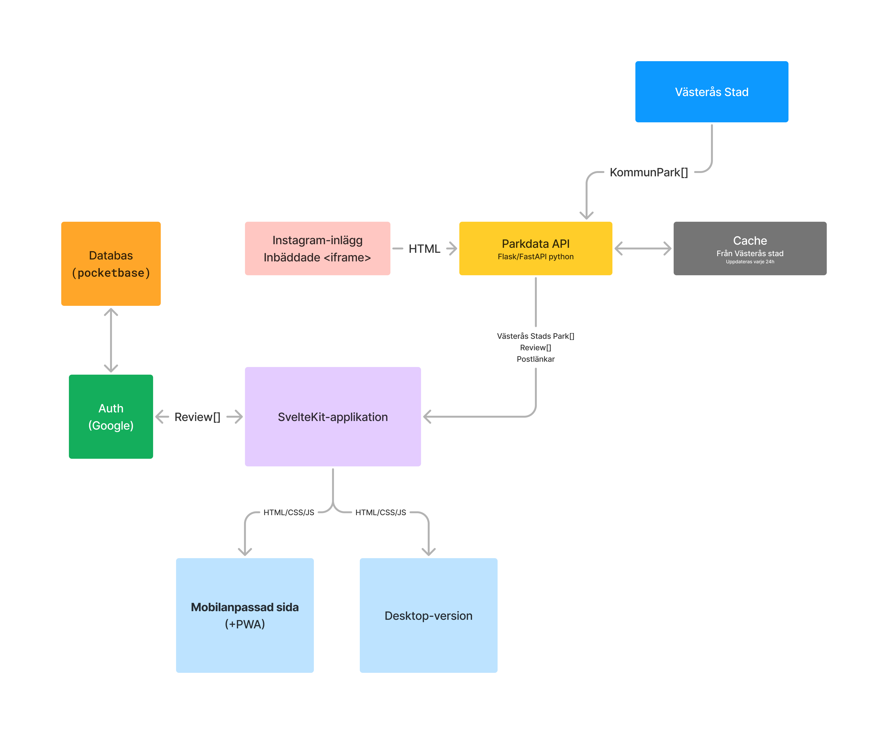

# Parkpappa

Parkpappa is a project to visualise the plethora of playgrounds in Västerås, in order to benefit families with small children.

## Modules

### Main focus areas and modules
- **Adrian** - SvelteKit Map, including fetching, filtering and displaying park data. Design of the application including icons, CSS and general layout.
- **David** - Python Park data API, including fetching data from Västerås Stad and presenting it in a better way, filtering of the data and caching it to avoid excess calls to the external API.
- **Eric** - Database operations, authentication/authorization and deployment of the app, including Sign in with Google integration, server configuration, Dockerization and configuring the app for production.

## Tech stack

### Frontend

- SvelteKit for Web Application framework
- Pocketbase for DB, auth and so on
- TailwindCSS
- Flowbite, ShadCN, Lucide, for nice UI components
- Prettier + ESLint for yelling at your code

### Backend

- Flask
- Requests
- `import json`

### DevOps

- Docker
- Pocketbase

## TODO

### Adrian

- [ ] Fixa SvelteKit-struktur
- [ ] Kolla Figma

### David Lockley

- [ ] Fixa Python-struktur
- [ ] Planera vilka bibliotek man ska ha

### Eric T

- [ ] Fixa en DB (pocketbase?)
- [ ] Fixa unit testing
- [ ] Fixa Docker
- [ ] Fixa formattering
- [ ] Konfa repot
